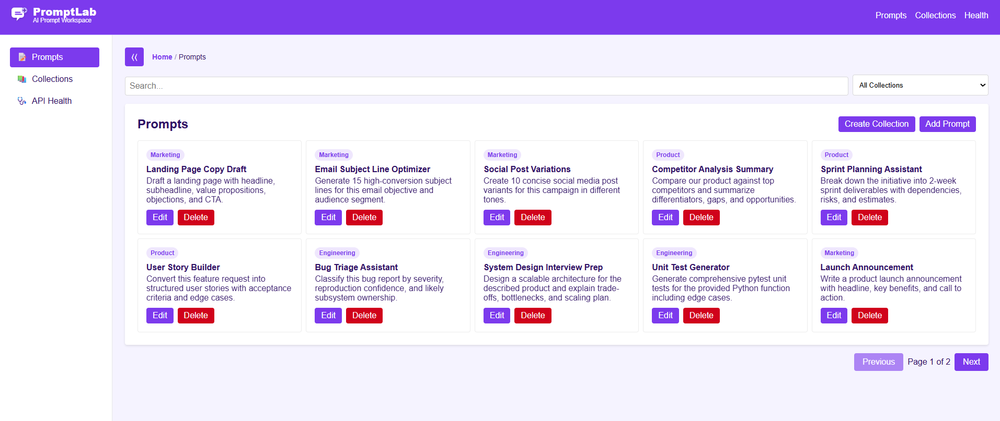
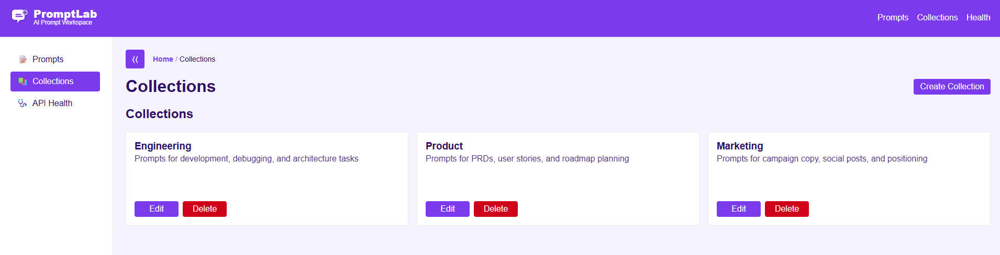
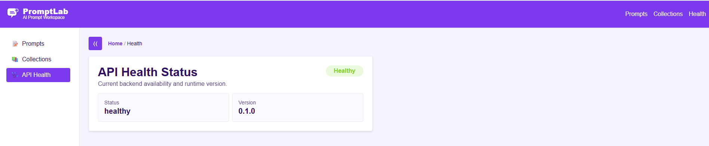

# PromptLab (10x Engineer Project)

PromptLab is a full-stack prompt management platform with a FastAPI backend and a React + Vite frontend.
It supports prompt and collection management, filtering/search, pagination, health checks, and a polished UI workflow for creating and organizing reusable AI prompts.

## Table of Contents

- [What This Project Includes](#what-this-project-includes)
- [Tech Stack](#tech-stack)
- [Repository Structure](#repository-structure)
- [Architecture](#architecture)
- [Quick Start](#quick-start)
- [Run with Docker Compose (Backend)](#run-with-docker-compose-backend)
- [Backend Details](#backend-details)
- [Frontend Details](#frontend-details)
- [API Summary](#api-summary)
- [Screenshots](#screenshots)
- [Testing](#testing)
- [Troubleshooting](#troubleshooting)

---

## What This Project Includes

- Prompt CRUD (create, read, update, delete)
- Collection CRUD (create, read, update, delete)
- Prompt search and collection-based filtering
- Pagination for prompt list views
- API health endpoint and frontend health page
- In-memory storage with startup mock seed data for demo/testing
- Python test suite for API/storage logic

---

## Tech Stack

### Backend

- FastAPI
- Uvicorn
- Pydantic
- Pytest / HTTPX

### Frontend

- React 18
- TypeScript
- Vite
- React Router
- CSS Modules + design tokens

---

## Repository Structure

```text
10x-engineer-project-repo/
├── backend/
│   ├── app/
│   │   ├── api.py
│   │   ├── models.py
│   │   ├── storage.py
│   │   └── utils.py
│   ├── tests/
│   ├── main.py
│   ├── requirements.txt
│   └── Dockerfile
├── promptlab-frontend/
│   ├── src/
│   │   ├── api/
│   │   ├── components/
│   │   ├── hooks/
│   │   ├── pages/
│   │   ├── styles/
│   │   └── types/
│   ├── package.json
│   └── vite.config.ts
├── docs/
│   ├── API_REFERENCE.md
│   └── images/
├── PROJECT_BRIEF.md
├── GRADING_RUBRIC.md
└── docker-compose.yml
```

---

## Architecture

```text
Frontend (Vite @ localhost:3000)
        │
        │ /api/* (Vite proxy in development)
        ▼
Backend API (FastAPI @ localhost:8000)
        │
        ▼
In-memory Storage (prompt + collection dictionaries)
```

- In development, the frontend uses `/api` and Vite proxies requests to `http://localhost:8000`.
- Backend storage is in-memory (`backend/app/storage.py`) and seeded with mock data on startup when empty.

---

## Quick Start

### 1) Start Backend

```bash
cd backend
python3 -m venv .venv
source .venv/bin/activate
pip install -r requirements.txt
python main.py
```

Backend runs at: `http://localhost:8000`

Useful docs:

- `http://localhost:8000/docs`
- `http://localhost:8000/redoc`

### 2) Start Frontend

Open a new terminal:

```bash
cd promptlab-frontend
npm install
npm run dev
```

Frontend runs at: `http://localhost:3000`

---

## Run with Docker Compose (Backend)

From repository root:

```bash
docker compose up --build
```

This starts the backend container on port `8000` using `uvicorn` with reload.

---

## Backend Details

Backend entry point: `backend/main.py`

### Core modules

- `backend/app/api.py`: API routes and request handling
- `backend/app/models.py`: Pydantic request/response schemas
- `backend/app/storage.py`: in-memory persistence + seed/mock data
- `backend/app/utils.py`: filtering/search/sorting/tag helper logic

### Data model highlights

- `Prompt` fields include: `title`, `content`, `description`, `collection_id`, `tags`, timestamps
- `Collection` fields include: `name`, `description`, timestamp
- Validation constraints are enforced by Pydantic models

---

## Frontend Details

Frontend root: `promptlab-frontend/`

### Key areas

- `src/pages/`: route-level views (`Prompts`, `Collections`, `Health`, create/edit pages)
- `src/components/`: reusable UI for prompts, collections, layout, common controls
- `src/api/`: fetch wrappers and endpoint-specific clients
- `src/hooks/`: data hooks for prompts/collections
- `src/styles/tokens.css`: theme tokens (colors, spacing, typography)

### Main implemented UX

- Prompt list with search, filter, pagination
- Collection cards with edit/delete actions
- Prompt creation requires selecting a collection
- Inline navigation to create missing collections
- Sidebar collapse/expand and breadcrumb navigation
- Health page rendering API status/version

---

## API Summary

### Health

- `GET /health`

### Prompts

- `GET /prompts`
- `GET /prompts/{prompt_id}`
- `POST /prompts`
- `PATCH /prompts/{prompt_id}`
- `PUT /prompts/{prompt_id}`
- `DELETE /prompts/{prompt_id}`

### Collections

- `GET /collections`
- `GET /collections/{collection_id}`
- `POST /collections`
- `PATCH /collections/{collection_id}`
- `DELETE /collections/{collection_id}`

For full request/response details, see `docs/API_REFERENCE.md` and FastAPI docs at `/docs`.

---

## Screenshots

> The following images are included in `docs/images/` to document the current UI flows.

### Prompts Page



### Collections Page



### Health Page



### Replacing with your real runtime screenshots

After running backend + frontend locally, you can replace these images with actual screenshots while keeping the same filenames:

- `docs/images/app-prompts.svg`
- `docs/images/app-collections.svg`
- `docs/images/app-health.svg`

---

## Testing

From `backend/`:

```bash
source .venv/bin/activate
pytest
```

Run a focused suite:

```bash
pytest tests/test_storage.py -q
```

---

## Troubleshooting

- **Frontend can’t reach backend**
  - Ensure backend is running on `http://localhost:8000`
  - Ensure frontend runs via `npm run dev` so Vite proxy works

- **No data appears**
  - Backend seeds mock data on startup if storage is empty
  - Restart backend to reseed in-memory state

- **Port already in use**
  - Stop existing process on `3000` or `8000`, then restart apps

---

For project goals and evaluation context:

- `PROJECT_BRIEF.md`
- `GRADING_RUBRIC.md`
